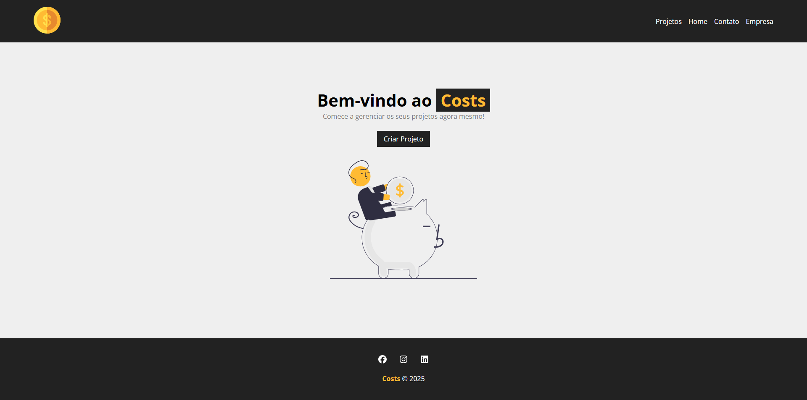

<h1>Costs</h1>

Costs é uma aplicação desenvolvida em React com uma API fake através de JSON SERVER, que permite gerenciar os custos de um projeto.



<h2>Funcionalidades</h2>

- Adicionar novos projetos com orçamentos, nome e categorias customizados
- Visualizar os projetos, apagá-los e editá-los
- Notificações personalizadas
- Adição e remoção de serviços para cada projeto

<h2>Como Executar o Projeto</h2>

Antes de tudo certifique-se de ter o [Node.JS](https://nodejs.org/en) mais atualizado instalado.

1. Clone o repositório:
```bash
git clone https://github.com/DFedizko/costs.git
```

2. Instale as dependências:
```bash
npm install
```

3. Inicie o backend:
```bash
npm run backend
```

4. Inicie a aplicação React:
```bash
npm start
```

<h2>Tecnologias Utilizadas</h2>
<div>
  
  
  
</div>

<h2>Sobre</h2>

O Costs é uma aplicação web com fins didáticos feito para aprender e praticar o desenvolvimento em React com uma API local fornecida pelo json server para simular uma API real, criado para ajudar os usuários a gerenciarem seus projetos, lidando com custos e despesas.

Crétidos ao Matheus Battisti do canal do youtube [Hora de Codar](https://www.youtube.com/@MatheusBattisti), foi esse o professor que me orientou durante esse projeto.

<h2>Desenvolvedor</h2>

| [<br><sub>Pedro Fedizko de Castro</sub>](https://github.com/DFedizko) |
| :---: |
